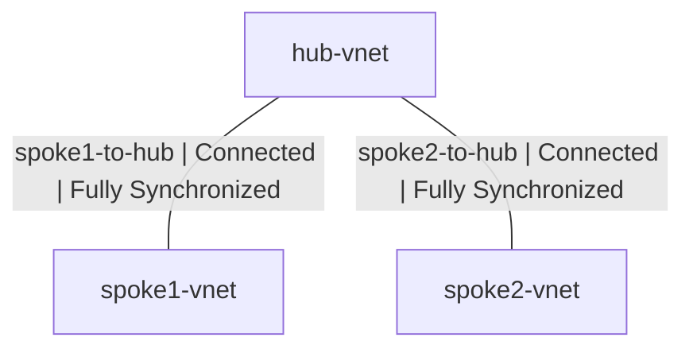

# Azure Hub-and-Spoke Network Topology

A hands-on Azure networking project demonstrating a hub-and-spoke virtual network architecture using Azure VNet Peering. This project establishes a central hub VNet connected to two spoke VNets, enabling controlled and scalable network segmentation in the cloud.

> 🔧 **Terraform Automation:** The infrastructure-as-code version of this project lives here → [azure-hub-spoke-terraform](https://github.com/maxmagnac/azure-hub-spoke-terraform)

## Network Topology

## Architecture Overview

| Component | Type | Role |
|---|---|---|
| hub-vnet | Azure Virtual Network | Central connectivity hub |
| spoke1-vnet | Azure Virtual Network | Workload segment 1 |
| spoke2-vnet | Azure Virtual Network | Workload segment 2 |
| spoke1-to-hub | VNet Peering | Spoke 1 to Hub peering link |
| hub-to-spoke1 | VNet Peering | Hub to Spoke 1 peering link |
| spoke2-to-hub | VNet Peering | Spoke 2 to Hub peering link |
| hub-to-spoke2 | VNet Peering | Hub to Spoke 2 peering link |

## Peering Configuration

Azure VNet Peering requires two peering links per connection - one from each side. This project configures all four links with the following settings:

**Hub to Spoke 1**
- Allow hub-vnet to access spoke1-vnet ✅
- Forward traffic from spoke1-vnet to hub-vnet ⬜
- Gateway or route server forwarding ⬜
- Remote gateway or route server ⬜

**Hub to Spoke 2**
- Allow hub-vnet to access spoke2-vnet ✅
- Forward traffic from spoke2-vnet to hub-vnet ⬜
- Gateway or route server forwarding ⬜
- Remote gateway or route server ⬜

## Screenshot Walkthrough

### 01 - Hub VNet

### 02 - Spoke 1 VNet

### 03 - Spoke 2 VNet

### 04 - Hub VNet Peerings Overview

### 04a - Hub to Spoke 1 Peering (Remote Settings)

### 04b - Hub to Spoke 1 Peering (Local Settings)

### 05 - Spoke 1 VNet Peerings

### 06 - Hub to Spoke 2 Peering (Remote Settings)

### 07 - Hub to Spoke 2 Peering (Local Settings)

### 08 - Hub VNet Spoke 2 Peering Connected

### 09 - Spoke 2 VNet Peerings

## Key Concepts

**Hub-and-Spoke Topology**
A hub-and-spoke architecture places a central hub VNet as the shared services and connectivity layer. Each spoke VNet connects to the hub, allowing controlled communication across workload segments without direct spoke-to-spoke peering.

**Azure VNet Peering**
VNet Peering connects two Azure virtual networks, making them function as a single network for connectivity purposes. Peering operates at low latency over the Microsoft backbone network without requiring gateways or encrypted tunnels.

**Bidirectional Peering Links**
Each peered connection requires two peering links - one initiated from each VNet. Both links must reach a Connected and Fully Synchronized state for traffic to flow correctly.

## Technologies Used
- Microsoft Azure
- Azure Virtual Networks (VNet)
- Azure VNet Peering
- Azure Portal

## Related Projects

| Project | Description |
|---|---|
| [azure-hub-spoke-terraform](https://github.com/maxmagnac/azure-hub-spoke-terraform) | Terraform automation of this exact architecture |

## Author
**Maurrin Carter** — [GitHub](https://github.com/maxmagnac)
